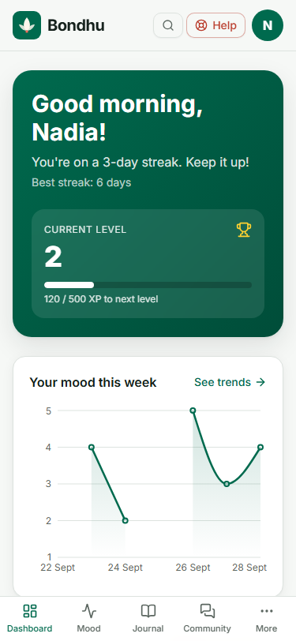
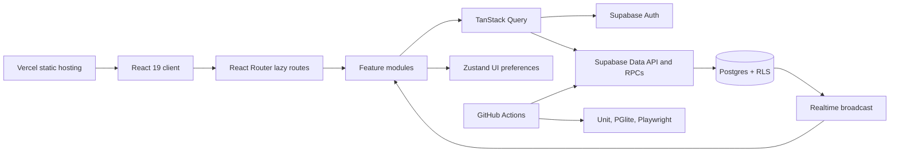
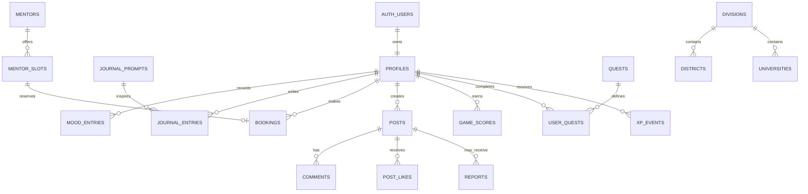

# Bondhu — a private wellness companion for Bangladesh

[](https://github.com/Hamza-32/bondhu-holistic-life-coaching/actions/workflows/ci.yml)
[](https://github.com/Hamza-32/bondhu-holistic-life-coaching/actions/workflows/e2e.yml)
[](LICENSE)

Bondhu (বন্ধু, “friend”) is an English/Bangla wellness and growth application for students and young professionals in Bangladesh. It combines private mood tracking and journaling, fictional coaching mentors, an anonymous community, career tools, verified help resources, and six low-pressure games.

> Bondhu is not a medical service and does not replace professional care. Its persistent **Need help now?** path surfaces verified Bangladesh helplines without requiring an account.


## Demo

The public deployment URL will be added after the first Vercel release. Locally, connect a Supabase project, enable anonymous sign-ins, and choose **Try demo**. Bondhu creates an isolated anonymous sandbox with a month of sample moods, journals, and game activity—no shared password or shared private data.

See [deployment instructions](docs/DEPLOYMENT.md) and [Supabase setup](docs/SUPABASE_SETUP.md).

## What is implemented

- Private mood check-ins with emotions, notes, and 7/30/90-day charts.
- Strictly private journal entries with bilingual prompts, search, editing, and deletion.
- Fictional mentor discovery and transaction-safe slot booking; verified real practitioner links open externally.
- Anonymous community posts, comments, optimistic likes, reports, realtime new-post signals, auto-hide, and database profanity guards.
- Career quiz and resume builder with autosave and client-side PDF export.
- Six accessible games: Shapla Breath, Rickshaw Memory, Nouka Drift, Shobdo, Kantha Canvas, and Bubble Pop Calm.
- XP, levels, supportive streaks, daily/weekly quests, personal bests, and alias-only leaderboards enforced by database rules.
- English/Bangla, light/dark/system themes, desktop sidebar, mobile tab bar, command palette, keyboard support, and reduced-motion variants.
- Crisis-phrase support in English, Bangla, and Banglish; privacy policy, JSON data export, and account deletion.
- Installable PWA shell, route-level splitting, prerendered landing page, SEO/social assets, Vercel Analytics, and Speed Insights.

| Desktop dashboard (dark)                                                       | Mobile dashboard (light)                                                       |
| ------------------------------------------------------------------------------ | ------------------------------------------------------------------------------ |
|  |  |

## Architecture



The public landing page is prerendered at build time and hydrated after first paint. Authenticated routes render as lazy client chunks. TanStack Query owns all remote data; Zustand persists only theme, sound, and haptics. Sensitive invariants live in Postgres functions, triggers, constraints, and RLS—not in the browser.

### Core data model



More detail: [architecture](docs/ARCHITECTURE.md) and [architecture decisions](docs/adr/).

## Technology

| Area         | Stack                                                                   |
| ------------ | ----------------------------------------------------------------------- |
| App          | React 19, TypeScript 6 strict mode, Vite 8, React Router 7              |
| UI           | Tailwind CSS 4, Radix/shadcn-style primitives, Motion, Lucide, Recharts |
| State/forms  | TanStack Query 5, Zustand 5, React Hook Form, Zod                       |
| Backend      | Supabase Auth, Postgres, Row Level Security, Realtime                   |
| Localisation | react-i18next, Inter, Hind Siliguri                                     |
| Testing      | Vitest, Testing Library, PGlite, Playwright, axe-core                   |
| Delivery     | Vercel, PWA/Workbox, GitHub Actions, Vercel Analytics/Speed Insights    |

## Local development

Requirements: Node.js 22 and npm.

```bash
git clone https://github.com/Hamza-32/bondhu-holistic-life-coaching.git
cd bondhu-holistic-life-coaching
npm ci
```

Copy `.env.example` to `.env.local` and add the public Supabase values:

```dotenv
VITE_SUPABASE_URL=https://your-project-ref.supabase.co
VITE_SUPABASE_ANON_KEY=your-publishable-or-anon-key
VITE_SITE_URL=http://localhost:3000
```

Then run:

```bash
npm run dev
```

The landing/auth shell works without a configured backend and shows setup guidance. Full features require the migrations and seed described in [docs/SUPABASE_SETUP.md](docs/SUPABASE_SETUP.md).

### Useful commands

| Command                 | Purpose                                                                   |
| ----------------------- | ------------------------------------------------------------------------- |
| `npm run build`         | Type-check, build the client/PWA, SSR-render, and inject the landing page |
| `npm run lint`          | ESLint with zero warnings                                                 |
| `npm run typecheck`     | Strict TypeScript project check                                           |
| `npm test`              | Unit and PGlite database projects                                         |
| `npm run test:coverage` | Unit tests with a 70% feature-API/shared-lib gate                         |
| `npm run test:db`       | Apply and test every migration in Postgres WASM                           |
| `npm run test:e2e`      | Desktop/mobile Playwright journeys and axe scans                          |
| `npm run db:seed:build` | Rebuild SQL seed files from reviewed source data                          |
| `npm run screenshots`   | Capture README images from a running production preview                   |

Current local suite: 147 unit tests, database policy/function tests, and desktop/mobile browser journeys. API/shared-library coverage is 88% statements, 78% branches, 95% functions, and 97% lines.

## Data integrity and privacy

- Every Bangladesh statistic, institution, calendar date, and phone number must be traceable in [DATA_SOURCES.md](docs/DATA_SOURCES.md).
- Real reference data is sourced; mentors, seed community members, and their avatars are fictional.
- Journal and mood rows are owner-only under RLS. Community views expose aliases, not profile identities.
- The service-role key never enters frontend code. The only browser credentials are Supabase's publishable URL/key pair.
- Crisis detection runs locally, never blocks expression, and never reports the user's writing.
- Account export and deletion are database-backed; deletion cascades through all user-owned records.

## Key engineering decisions

- [Supabase backend](docs/adr/0001-supabase-backend.md): centralise privacy and concurrency guarantees in Postgres.
- [Server vs local state](docs/adr/0002-server-and-client-state.md): TanStack Query for remote data; Zustand only for UI preferences.
- [Feature-sliced lazy routes](docs/adr/0003-feature-sliced-routes.md): isolate domains and keep first-load JavaScript small.

## Roadmap

- Publish the Vercel deployment and replace this README's pending demo note with the verified production URL.
- Re-check Kaan Pete Roi's official number/hours before including it (`TODO: VERIFY`; currently excluded).
- Seed the deferred, source-reviewed resource library and Bangladesh career-path catalogue.
- Re-verify 2027 public holidays and SSC/HSC dates once official notices exist.
- Continue improving mobile Lighthouse performance; the prerendered landing page measured 88–89 in the last local run, with desktop at 100.

## Contributing and license

Read [CONTRIBUTING.md](CONTRIBUTING.md) before submitting changes, especially the safety and factual-data rules. Bondhu is available under the [MIT License](LICENSE).
