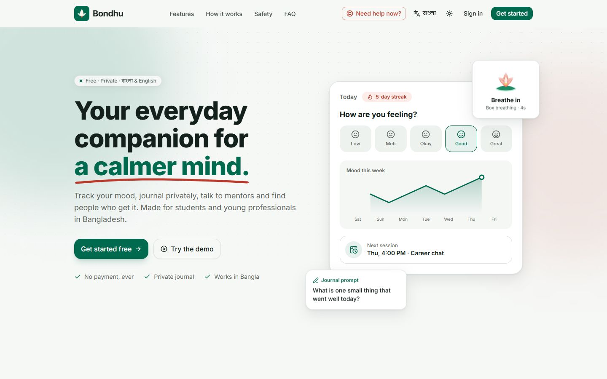
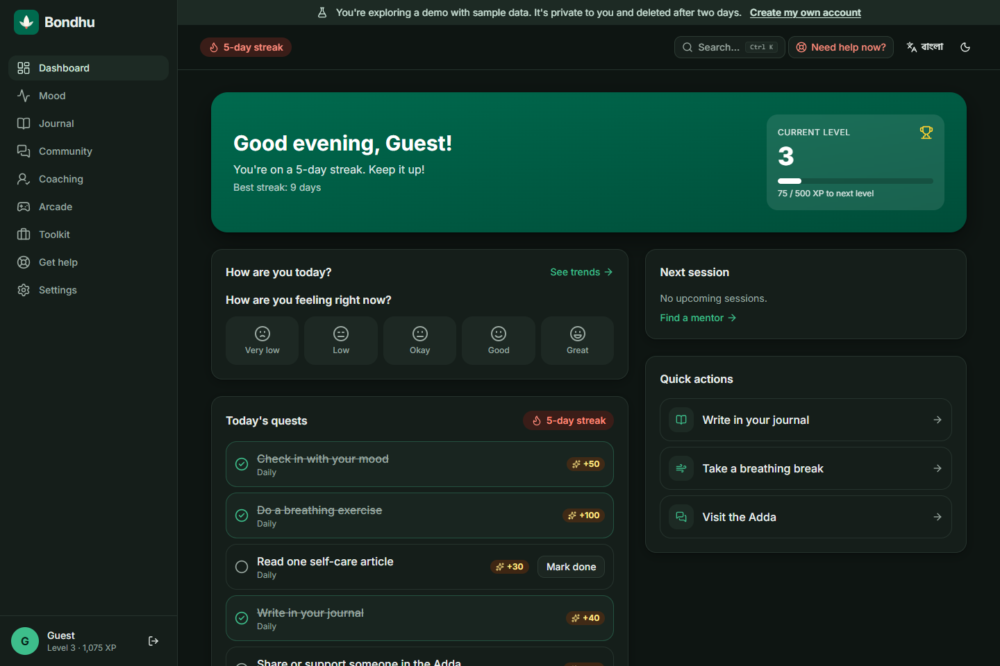
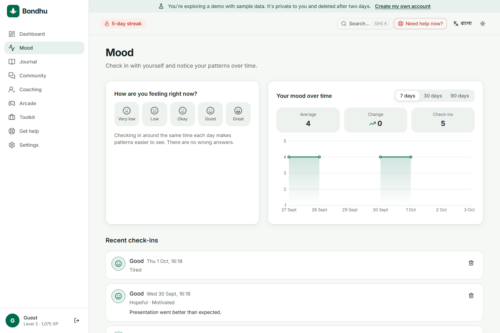
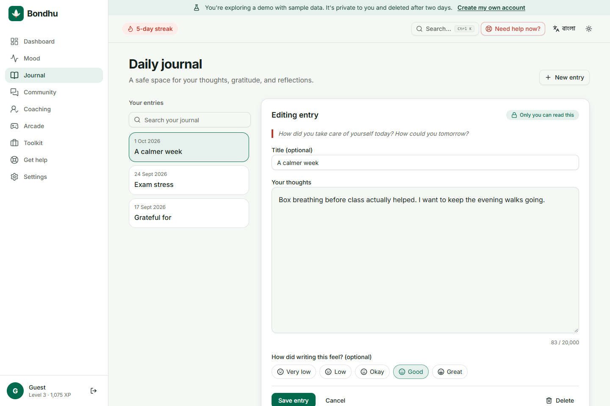
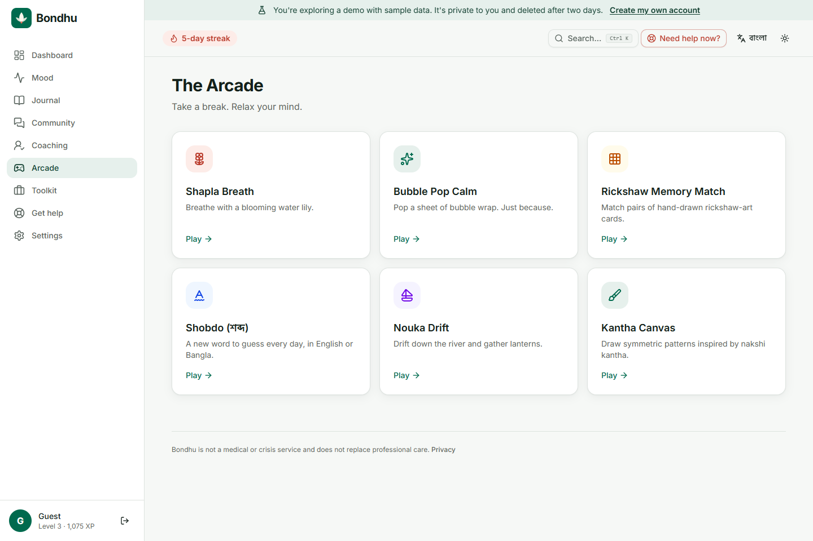
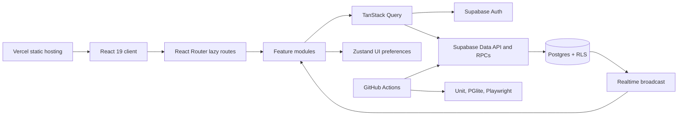
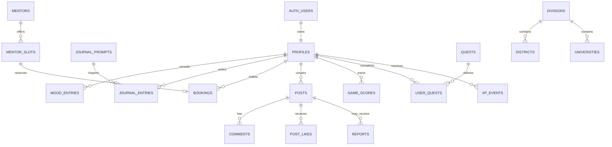

# Bondhu — a private wellness companion for Bangladesh

[](https://github.com/Hamza-32/bondhu-holistic-life-coaching/actions/workflows/ci.yml)
[](https://github.com/Hamza-32/bondhu-holistic-life-coaching/actions/workflows/e2e.yml)
[](LICENSE)

[Live demo](https://bondhu-life-coaching.vercel.app) · [Project case study](docs/PORTFOLIO.md) · [Screenshot gallery](docs/screenshots/README.md) · [Architecture](docs/ARCHITECTURE.md)

Bondhu (বন্ধু, “friend”) is a full-stack English/Bangla wellness and growth application for students and young professionals in Bangladesh. It combines private mood tracking and journaling, fictional coaching mentors, an alias-based community, career tools, sourced help resources, and six low-pressure games.

Built and maintained by [Hamza-32](https://github.com/Hamza-32). The project demonstrates responsive product design, typed feature modules, database-enforced access rules, accessible interactions, and automated delivery.

> Bondhu is not a medical service and does not replace professional care. Its persistent **Need help now?** path surfaces verified Bangladesh helplines without requiring an account.



## Explore in two minutes

1. Open [Bondhu](https://bondhu-life-coaching.vercel.app) and choose **Try the demo**. No email or shared password is needed.
2. Explore **Mood** and **Journal**, then try **Arcade → Shapla Breath**. The demo starts with fictional sample data in a separate anonymous account.
3. Switch to **বাংলা**, toggle dark mode, or try the mobile layout. **Need help now?** and the [privacy page](https://bondhu-life-coaching.vercel.app/privacy) also work without an account.

The hosted demo uses Supabase and Vercel. It may be temporarily unavailable when hosting quotas are reached or a free-tier project is paused. A local setup is available below. Demo mentor bookings do not arrange real appointments; do not enter sensitive personal information while evaluating the project.

See [deployment instructions](docs/DEPLOYMENT.md) and [Supabase setup](docs/SUPABASE_SETUP.md).

## What is implemented

- Private mood check-ins with emotions, notes, and 7/30/90-day charts.
- Strictly private journal entries with bilingual prompts, search, editing, and deletion.
- Fictional mentor discovery and transaction-safe slot booking; verified real practitioner links open externally.
- Anonymous community posts, comments, optimistic likes, reports, realtime new-post signals, auto-hide, and database profanity guards.
- Career quiz and resume builder with autosave and client-side PDF export.
- Six accessible games: Shapla Breath, Rickshaw Memory, Nouka Drift, Shobdo, Kantha Canvas, and Bubble Pop Calm.
- XP, levels, supportive streaks, daily/weekly quests, personal bests, and alias-only leaderboards enforced by database rules.
- English/Bangla, light/dark/system themes, desktop sidebar, mobile tab bar, command palette, keyboard support, and reduced-motion variants.
- Crisis-phrase support in English, Bangla, and Banglish; privacy policy, JSON data export, and account deletion.
- Installable PWA shell, route-level splitting, prerendered landing page, SEO/social assets, Vercel Analytics, and Speed Insights.

## Screenshots

Captured from the working app with fictional demo data. The [full gallery](docs/screenshots/README.md) includes mobile and Bangla views, routes, and capture instructions.

| Dashboard · dark                                                                                             | Mood tracking · light                                                                |
| ------------------------------------------------------------------------------------------------------------ | ------------------------------------------------------------------------------------ |
|  |  |

| Private journal                                                                            | Calm arcade                                                                               |
| ------------------------------------------------------------------------------------------ | ----------------------------------------------------------------------------------------- |
|  |  |

## Architecture



The public landing page is prerendered at build time and hydrated after first paint. Authenticated routes render as lazy client chunks. TanStack Query owns all remote data; Zustand persists only theme, sound, and haptics. Sensitive invariants live in Postgres functions, triggers, constraints, and RLS—not in the browser.

### Core data model



More detail: [architecture](docs/ARCHITECTURE.md) and [architecture decisions](docs/adr/).

## Technology

| Area         | Stack                                                                   |
| ------------ | ----------------------------------------------------------------------- |
| App          | React 19, TypeScript 6 strict mode, Vite 8, React Router 7              |
| UI           | Tailwind CSS 4, Radix/shadcn-style primitives, Motion, Lucide, Recharts |
| State/forms  | TanStack Query 5, Zustand 5, React Hook Form, Zod                       |
| Backend      | Supabase Auth, Postgres, Row Level Security, Realtime                   |
| Localisation | react-i18next, Inter, Hind Siliguri                                     |
| Testing      | Vitest, Testing Library, PGlite, Playwright, axe-core                   |
| Delivery     | Vercel, PWA/Workbox, GitHub Actions, Vercel Analytics/Speed Insights    |

## Local development

Requirements: Node.js 22.16+ (or 24 LTS) and npm. The TypeScript build scripts require Node 22+, even though Vite itself supports some older runtimes.

```bash
git clone https://github.com/Hamza-32/bondhu-holistic-life-coaching.git
cd bondhu-holistic-life-coaching
npm ci
```

Copy `.env.example` to `.env.local` and add the public Supabase values:

```dotenv
VITE_SUPABASE_URL=https://your-project-ref.supabase.co
VITE_SUPABASE_ANON_KEY=your-publishable-or-anon-key
VITE_SITE_URL=http://localhost:3000
```

Then run:

```bash
npm run dev
```

Open [localhost:3000](http://localhost:3000). The landing/auth shell works without a configured backend and shows setup guidance. Full features require the migrations and seed described in [docs/SUPABASE_SETUP.md](docs/SUPABASE_SETUP.md). Use your own Supabase project for local development; never reset the hosted demo database.

Only the public Supabase URL/key belong in frontend configuration. Do not add service-role keys, OAuth secrets, SMTP passwords, or other private credentials to `VITE_` variables. `.env.local` is git-ignored.

### Useful commands

| Command                 | Purpose                                                                   |
| ----------------------- | ------------------------------------------------------------------------- |
| `npm run build`         | Type-check, build the client/PWA, SSR-render, and inject the landing page |
| `npm run lint`          | ESLint with zero warnings                                                 |
| `npm run typecheck`     | Strict TypeScript project check                                           |
| `npm test`              | Unit and PGlite database projects                                         |
| `npm run test:coverage` | Unit tests with a 70% feature-API/shared-lib gate                         |
| `npm run test:db`       | Apply and test every migration in Postgres WASM                           |
| `npm run test:e2e`      | Desktop/mobile Playwright journeys and axe scans                          |
| `npm run db:seed:build` | Rebuild SQL seed files from reviewed source data                          |
| `npm run screenshots`   | Capture README images from a running production preview                   |

The suite includes 147 unit tests, 35 database policy/function tests, and 114 desktop/mobile Playwright journeys and accessibility scans. CI enforces a 70% coverage minimum for feature APIs and shared libraries; it does not imply whole-application coverage. Run the commands above for current results; GitHub Actions badges link to the latest hosted runs.

Browser tests use an intercepted Supabase API with fictional fixtures; database tests separately apply the real SQL migrations in PGlite. Neither replaces hosted OAuth, email-delivery, or production smoke tests.

## Data integrity and privacy

- Every Bangladesh statistic, institution, calendar date, and phone number must be traceable in [DATA_SOURCES.md](docs/DATA_SOURCES.md).
- Real reference data is sourced; mentors, seed community members, and their avatars are fictional.
- Journal and mood rows are owner-only under RLS. Community views expose aliases, not profile identities.
- Community aliases conceal identity from other members, not from the service operator. RLS is access control, not end-to-end encryption.
- The service-role key never enters frontend code. The only browser credentials are Supabase's publishable URL/key pair.
- Crisis detection runs locally, never blocks expression, and never reports the user's writing.
- Account export and deletion are database-backed; deletion cascades through all user-owned records.

## Key engineering decisions

- [Supabase backend](docs/adr/0001-supabase-backend.md): centralise privacy and concurrency guarantees in Postgres.
- [Server vs local state](docs/adr/0002-server-and-client-state.md): TanStack Query for remote data; Zustand only for UI preferences.
- [Feature-sliced lazy routes](docs/adr/0003-feature-sliced-routes.md): isolate domains and keep first-load JavaScript small.

## Status and next improvements

The application is deployed and suitable for a portfolio walkthrough. It is not presented as a clinically validated product or an independently audited production service.

- Before opening email registration to the public, configure custom SMTP and test confirmations and password resets. Google OAuth requires provider setup and the appropriate consent-screen audience. See the [launch checklist](docs/DEPLOYMENT.md#before-opening-to-public-users).
- Enable and verify the optional expired-demo cleanup workflow, operational monitoring, and backup/recovery procedures in your own hosted project.
- Re-check Kaan Pete Roi's official number/hours before including it (`TODO: VERIFY`; currently excluded).
- Seed the deferred, source-reviewed resource library and Bangladesh career-path catalogue.
- Re-verify 2027 public holidays and SSC/HSC dates once official notices exist.
- Continue mobile performance work; Lighthouse measurements depend on the environment and are not a production SLA.

## Repository guide

| Document                                                   | Purpose                                                       |
| ---------------------------------------------------------- | ------------------------------------------------------------- |
| [Project case study](docs/PORTFOLIO.md)                    | Product problem, implementation, trade-offs, and review guide |
| [Architecture](docs/ARCHITECTURE.md) and [ADRs](docs/adr/) | Current system and the decisions behind it                    |
| [Supabase setup](docs/SUPABASE_SETUP.md)                   | Schema, seed, authentication, and local setup                 |
| [Deployment runbook](docs/DEPLOYMENT.md)                   | Vercel settings, auth redirects, verification, and rollback   |
| [Data sources](docs/DATA_SOURCES.md)                       | Evidence and review status for Bangladesh reference data      |
| [Security policy](SECURITY.md)                             | Private vulnerability reporting and safe testing              |
| [Contributing](CONTRIBUTING.md)                            | Checks, coding workflow, and safety rules                     |

## Contributing and license

Read [CONTRIBUTING.md](CONTRIBUTING.md) before submitting changes, especially the safety and factual-data rules. Bondhu is available under the [MIT License](LICENSE).
