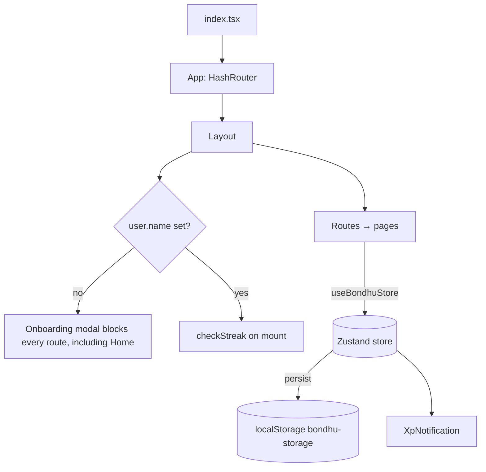

# Bondhu: Architecture

> **Status:** Phase 4 (core features on the real backend) complete, 2026-09-26. §0 describes the current system.
> §1–§7 are the Phase 0 audit of the pre-upgrade MVP (commit `aa92ca9`) and the Supabase
> migration plan; they stay as the reference for Phase 4. Findings already fixed are marked ✅.

---

## 0. Current system

### Tooling

| Concern       | Setup                                                                                                                                                                                                                                                                                            |
| ------------- | ------------------------------------------------------------------------------------------------------------------------------------------------------------------------------------------------------------------------------------------------------------------------------------------------ |
| Build         | Vite 8 (Rolldown) + `@vitejs/plugin-react` 6. Every page is a lazy chunk. Vendor libraries are grouped into cacheable chunks (`react`, `supabase`, `motion`, `radix`, `i18n`, `forms`).                                                                                                          |
| Types         | TypeScript 6.0, `strict` + `noUncheckedIndexedAccess`, `verbatimModuleSyntax`. `tsc -b` with `tsconfig.app.json` (src) and `tsconfig.node.json` (configs, e2e, scripts, DB tests). TS 7 waits for typescript-eslint support.                                                                     |
| Lint / format | ESLint 9: `typescript-eslint` strict-type-checked + stylistic, `react-hooks` 7 (React Compiler rules), `jsx-a11y`, `react-refresh`. Prettier with Tailwind class sorting.                                                                                                                        |
| Git hooks     | Husky `pre-commit` → lint-staged.                                                                                                                                                                                                                                                                |
| Tests         | Vitest projects: `unit` (jsdom + Testing Library, `src/**`) and `db` (Node + PGlite, `supabase/tests/**`). Playwright E2E against the production build on desktop and a 375 px viewport: public/auth flows, plus every signed-in page against a mocked Supabase (`e2e/support/mockSupabase.ts`). |
| Backend       | Supabase (hosted, free tier). Migrations in `supabase/migrations`, seed in `supabase/seed/` (generated from verified data in `supabase/data/`), CLI through `npx supabase`. No Docker: see [SUPABASE_SETUP.md](./SUPABASE_SETUP.md).                                                             |

### Source layout

```text
src/
  app/                   App, router, layouts (Root, Public, App), errors, providers, navigation
  features/
    auth/                AuthProvider + context, api (Supabase auth calls), schemas (Zod), errors,
                         redirect (safe `next`), components (AuthLayout, RouteGuards, FormBits,
                         SetupNotice, CheckEmail), pages (Login, Signup, Forgot/Reset password, Callback)
    onboarding/          4-step onboarding (name/language, alias, place, goals), alias generator
    profile/             useProfile / useUpdateProfile (TanStack Query)
    reference/           useDivisions / useUniversities
    dashboard/           Greeting, level/XP, streak, quests, mood check-in, next session
    mood/                Check-in, 7/30/90-day chart (lazy Recharts), history; Dhaka-day aggregation
    journal/             Private entries with bilingual prompts, search, edit, delete
    coaching/            Demo mentors + slot booking (book_slot RPC); real practitioner directory (external links)
    community/           Feed (get_feed), composer, optimistic likes, comments, reports, live new-post signal
    toolkit/             Resume builder (autosave, lazy PDF export) and career quiz
    resources/           Get help: verified helplines and organisations
    gamification/        Quests, XP toasts, level helpers (values come from the database)
    arcade/              Hub + six lazy games (one folder each) on a shared GameShell; see "Arcade"
    landing/             Landing page sections, verified sources
  components/            Shared: Logo, toggles, Container, Reveal, site header/footer, illustrations
  components/ui/         shadcn/ui primitives
  lib/                   supabase (typed client), env (Zod validation), queryClient, i18n, utils,
                         database.types.ts (generated)
  locales/               en.json (typed source of truth), bn.json
  stores/                useUiStore (theme, sound, haptics; all domain data lives in Supabase via TanStack Query)
supabase/
  migrations/            Schema, RLS, grants, functions, triggers (see "Database" below)
  data/                  Verified research data (JSON, with source URL + evidence per entry)
  seed/                  01_reference, 02_safety, 03_content (generated by scripts/build-seed.ts),
                         04_fictional (demo mentors, posts, prompts)
  tests/                 PGlite harness + schema/RLS/function tests
scripts/gen-db-types.ts  Generates database.types.ts from the migrations, offline
```

### Routes

| Path                                    | Guard       | Layout       | Notes                                                                |
| --------------------------------------- | ----------- | ------------ | -------------------------------------------------------------------- |
| `/`                                     | none        | PublicLayout | Landing page                                                         |
| `/login`, `/signup`, `/forgot-password` | GuestOnly   | AuthLayout   | Signed-in users are redirected to `next` or `/app`                   |
| `/reset-password`, `/auth/callback`     | none        | AuthLayout   | Email links and OAuth return here (must be allow-listed in Supabase) |
| `/onboarding`                           | RequireAuth | own          | Shown until `profiles.onboarding_done`                               |
| `/app/*`                                | RequireAuth | AppLayout    | Requires a session and finished onboarding                           |
| `/*`                                    | none        | PublicLayout | 404                                                                  |

`RequireAuth` sends signed-out visitors to `/login?next=<path>`. `next` is validated by `safeNextPath()` against open redirects (unit-tested).

### Auth

- Supabase Auth with PKCE: email + password, magic link, password reset, Google OAuth. Sessions persist in `localStorage` (`bondhu-auth`) and refresh automatically.
- `AuthProvider` exposes `loading | unconfigured | signedOut | signedIn`. On sign-out it clears the TanStack Query cache and the legacy local store. When a _different_ account signs in on the same device, the legacy local data is cleared too, so one person never sees another's journal.
- If `VITE_SUPABASE_*` is missing or invalid, the landing page still works, and auth pages show setup steps (`SetupNotice`) instead of crashing.
- Supabase error codes map to friendly, translated messages (`authErrorKey`). A sign-up for an existing email (which Supabase hides) is detected and reported.

### Database

All tables are in `public` with RLS on. Grants are explicit (the project does not auto-expose tables). Internal functions live in a non-exposed `private` schema.

| Area         | Tables                                                                                                                                                                                 | Key rules                                                                                                                                                                                                                                                      |
| ------------ | -------------------------------------------------------------------------------------------------------------------------------------------------------------------------------------- | -------------------------------------------------------------------------------------------------------------------------------------------------------------------------------------------------------------------------------------------------------------- |
| Reference    | `divisions`, `districts`, `universities`, `journal_prompts`, `quests`, `mentors`, `mentor_slots`, `resources`, `helplines`, `support_organizations`, `career_paths`, `calendar_events` | Public read-only                                                                                                                                                                                                                                               |
| Directory    | `practitioners`                                                                                                                                                                        | Real professionals' public listings (build plan rule 8 amendment). Public read-only; `booking_url` must be https and points to their own official page. Bondhu never books                                                                                     |
| Profile      | `profiles`                                                                                                                                                                             | Created by a trigger on signup, with a unique Bangladeshi-motif alias. Owner reads and updates only personal columns. `xp`, `level` and streak columns have **no client grant**                                                                                |
| Private      | `mood_entries`, `journal_entries`, `quiz_results`, `resumes`                                                                                                                           | Owner-only for every operation. `user_id` defaults to `auth.uid()` and is not client-writable                                                                                                                                                                  |
| Coaching     | `bookings`                                                                                                                                                                             | Created only through `book_slot()` (row lock) with a partial unique index as a backstop; `cancel_booking()` frees the slot. Max 3 upcoming bookings per user                                                                                                   |
| Community    | `posts`, `comments`, `post_likes`, `reports`                                                                                                                                           | `user_id` is **never readable** by clients. The feed comes from `get_feed()` / `get_comments()`, which return `is_mine` / `liked_by_me`. Aliases and counters are set by triggers. Auto-hide after 3 distinct reports                                          |
| Gamification | `user_quests`, `game_scores`, `xp_events`                                                                                                                                              | XP and streaks come only from activity triggers → `private.record_activity()`: streak by Asia/Dhaka date (a gap restarts at 1, never a penalty), per-day XP caps, auto-completing quests, `xp_events` audit log. `complete_quest()` accepts manual quests only |

Reference seed SQL is generated from `supabase/data/*.json` with `npm run db:seed:build` (VERIFIED entries only; see [DATA_SOURCES.md](./DATA_SOURCES.md)). Seeded community posts have no author account (`user_id` null) and never award XP.

Types in `src/lib/database.types.ts` are generated from the migrations with `npm run db:types:local` (PGlite; no Docker), or from the live project with `npm run db:types`.

### Arcade

`/app/arcade` is a hub; each game is its own lazy route and chunk (`/app/arcade/<slug>`, 2–5 kB gzipped).

| Game (folder)                       | Play                                                                                                                                             | Score sent to `game_scores`        | Leaderboard   |
| ----------------------------------- | ------------------------------------------------------------------------------------------------------------------------------------------------ | ---------------------------------- | ------------- |
| Shapla Breath (`shapla-breath`)     | Box 4-4-4-4 or 4-7-8, animated SVG shapla, timer, optional vibration                                                                             | Seconds (only sessions ≥ 60 s)     | Most sessions |
| Bubble Pop Calm (`bubble-pop`)      | 6 × 8 bubble sheet, all-time pop counter                                                                                                         | 48 per finished sheet              | Most sessions |
| Rickshaw Memory (`rickshaw-memory`) | 3 difficulties, 12 original rickshaw-art SVG motifs, moves + timer                                                                               | Points (pairs, moves, time, level) | Top score     |
| Shobdo (`shobdo`)                   | Daily word (Asia/Dhaka) in English (5 letters) or Bangla (3 grapheme clusters via `Intl.Segmenter`), Bangla on-screen keyboard, emoji share grid | 7 − guesses (0 if unsolved)        | Most sessions |
| Nouka Drift (`nouka-drift`)         | Canvas river, 90 s day → sunset → night parallax, lanterns; logs only slow you                                                                   | Lanterns collected                 | Top score     |
| Kantha Canvas (`kantha-canvas`)     | 4–12-fold radial symmetry, mirror, running stitch, palettes, PNG export, "add a motif" (G)                                                       | Strokes per saved design           | Most sessions |

- **Shared (`arcade/shared`):** `GameShell` (back link, how-to, pause/restart, sound toggle, personal best, leaderboard), `useRecordGame` / `useLeaderboard`, `usePersonalBest` (device-local, `bondhu-arcade-best`), `useSound` (synthesised Web Audio, **off by default**), `useKeydown`, roving-focus `moveFocus`, `useElapsed`.
- **XP cannot be farmed from the client:** every `game_scores` insert earns a fixed 15 XP from a trigger, capped at 5 per day; a Shapla session also completes the breathing quest. Scores are clamped client-side and in the table.
- **Leaderboards:** `get_leaderboard(game, mode)` is a security-definer RPC returning the top 10 plus the caller's own rank, with **anonymous aliases only** (never user ids). `best` = highest score, `total` = number of sessions.
- **Accessibility:** every game is keyboard-playable (arrow keys, Enter/Space, P/Escape to pause, G for motifs), has touch and mouse input, and honours `prefers-reduced-motion` (no flips, bobbing or parallax scrolling). Game logic lives in pure, unit-tested modules (`patterns`, `logic`, `engine`, `symmetry`).

### Design system

Tokens are CSS variables in `src/styles/globals.css`, mapped to Tailwind with `@theme inline`. The palette uses softened Bangladesh green as primary (`#006a4e` light / `#3dbe8b` dark), a coral accent, and green-tinted neutrals. Contrast is measured (AA) and recorded in the file. Dark mode is class-based, with a pre-paint script to avoid a flash. Fonts: Inter Variable, and Hind Siliguri for Bangla, with a line height of 1.75.

### i18n

`react-i18next` with English and Bangla. Keys are type-checked against `en.json`, and a test enforces key, placeholder and list parity. Translated so far: shell, landing, auth, onboarding and page headers. Legacy page bodies are translated in Phase 4.

### Data flow and live updates

- Every read and write goes through TanStack Query hooks in `features/*/api.ts`. Activity mutations call `refreshGamification()`, which refetches the profile and quests so the XP, level and streak computed by database triggers show up. `useXpFeedback` turns XP changes into toasts.
- **Community live updates:** a trigger broadcasts only the new post's id on the public `community-feed` topic (`realtime.send`). Clients show a "new posts" button and refetch through `get_feed()`, so author ids never travel over Realtime.
- **Heavy libraries load on demand:** Recharts loads only when a chart renders, and the PDF engine only when a user downloads a resume.
- **Legacy data:** the MVP's `localStorage` store was removed. Its old keys are deleted on startup and never migrated (§6.1).

---

## 1. Summary

Bondhu is a client-only single-page app: React 19, TypeScript, Vite 6, and one Zustand store saved to `localStorage`. It has no backend, no auth, no tests, no linting and no CI. Every mentor, post, quest and resource is hard-coded mock data. Every user action (XP, streaks, bookings, journal entries) changes local state only.

The app builds and runs, but the TypeScript safety net is mostly off (see [§5.1](#51-tooling-and-build)). Several product claims and data points are invented, which the build plan's data rules forbid (see [§5.4](#54-data-integrity-rules-7-and-8)).

---

## 2. Stack as found

| Concern   | What's there                                                                                       | Notes                                                     |
| --------- | -------------------------------------------------------------------------------------------------- | --------------------------------------------------------- |
| Framework | React 19.2, TypeScript 5.8, Vite 6.4                                                               | `@types/react` / `@types/react-dom` are **not installed** |
| Routing   | `react-router-dom` 7, `HashRouter`                                                                 | 8 eager routes, no lazy loading, no 404 route             |
| State     | Zustand 5 + `persist` → `localStorage["bondhu-storage"]`                                           | A single store holds all domain data                      |
| Styling   | **Tailwind Play CDN** (`<script src="cdn.tailwindcss.com">`) with an inline config in `index.html` | Not meant for production; no build-time purge             |
| Animation | `framer-motion` 12                                                                                 | No `prefers-reduced-motion` handling                      |
| Icons     | `lucide-react` 0.563                                                                               |                                                           |
| Fonts     | Google Fonts `<link>` (Inter only)                                                                 | No Bangla font                                            |
| Quality   | none                                                                                               | No ESLint, Prettier, tests, Husky or CI                   |
| Hosting   | none configured                                                                                    | README has a placeholder demo link                        |

**Leftovers from the Google AI Studio template** (to remove in Phase 1):

- An `importmap` in `index.html` that points to `esm.sh`. Vite bundles from `node_modules`, so the import map does nothing, but it still ships in `dist/index.html`.
- `vite.config.ts` uses `define` to put `GEMINI_API_KEY` into `process.env.*`. No code uses it today. If anything ever referenced `process.env.API_KEY`, the secret would be **inlined into the public bundle**. `.env.local` is gitignored, and I checked that it has never been committed.
- `metadata.json` (AI Studio app metadata; not used by the build).
- `tsconfig.json` flags that do nothing here: `experimentalDecorators`, `useDefineForClassFields: false`, `allowJs`.

---

## 3. File layout as found

All source files sit at the repository root. There is no `src/`, even though the README says there is.

```text
index.html          Tailwind CDN + config, import map, font link, root div
index.tsx           createRoot → <App/>
index.css           no-scrollbar utility, ::selection colour (linked from index.html)
App.tsx             HashRouter → <Layout> → 8 <Route>s
types.ts            UserProfile, Coach, Session, Post, PostComment, Quest, JournalEntry
store/
  useBondhuStore.ts All domain state, mock seed data and actions (≈270 lines)
components/
  Layout.tsx        Top navbar (desktop + mobile drawer), streak badge, logout, mounts Onboarding + XpNotification
  Onboarding.tsx    Full-screen modal asking for a name; shown while user.name === ""
  XpNotification.tsx Toast driven by store.notification
  CareerQuiz.tsx    3-question quiz → one of 4 generic archetypes (all local constants)
  ResumeBuilder.tsx Local form state + live preview; "PDF" = window.print()
pages/
  Home.tsx          Marketing hero, 3 value props, rotating quotes
  Dashboard.tsx     Level/XP bar, mood score, coins, daily quests, upcoming sessions
  Coaching.tsx      3 mock coaches, booking modal (hard-coded time slot)
  Community.tsx     Post composer, feed, likes, inline comments
  Journal.tsx       Composer with 3-mood picker, 5 most recent entries
  Toolkit.tsx       Tabs: mood tracker | CareerQuiz | ResumeBuilder
  Arcade.tsx        Tabs: breathing | bubble popper | emoji memory match
  Resources.tsx     6 hard-coded resource cards, search + category filter
```

### Runtime flow



---

## 4. The Zustand store

`store/useBondhuStore.ts` is the whole "backend". This is its state:

| Key              | Type                                                                             | Seeded with                                              |
| ---------------- | -------------------------------------------------------------------------------- | -------------------------------------------------------- |
| `user`           | `UserProfile` (name, level, xp, streak, coins, moodScore, badges, lastLoginDate) | Empty name (triggers onboarding), 50 coins, moodScore 50 |
| `coaches`        | `Coach[]`                                                                        | 3 coaches with `picsum.photos` images and `$` prices     |
| `sessions`       | `Session[]`                                                                      | empty                                                    |
| `posts`          | `Post[]` (comments embedded)                                                     | 3 posts with static "2h ago"-style timestamps            |
| `quests`         | `Quest[]`                                                                        | 3 quests (50 / 100 / 30 XP)                              |
| `journalEntries` | `JournalEntry[]`                                                                 | empty                                                    |
| `notification`   | `{message, visible} \| null`                                                     | null                                                     |

These are the actions and what they do:

| Action                   | Behaviour                                                                 | Problem                                                                                                                                                                             |
| ------------------------ | ------------------------------------------------------------------------- | ----------------------------------------------------------------------------------------------------------------------------------------------------------------------------------- |
| `setUserName`            | Sets the name, +100 XP, calls `checkStreak`                               | —                                                                                                                                                                                   |
| `checkStreak`            | Compares `lastLoginDate` with today using `toISOString()`                 | Uses **UTC** dates. From 00:00 to 06:00 Dhaka time (UTC+6) it counts the wrong day. It also calls `setTimeout` inside the `set()` updater, which is a side effect inside a reducer. |
| `addXp`                  | Adds XP; level = `floor(xp/500)+1`; shows a toast and clears it after 3 s | Each call's timer clears whatever toast is showing, so overlapping toasts disappear early. XP is calculated on the client, so anyone can change it.                                 |
| `bookSession`            | Appends a session, −50 coins, +150 XP                                     | No check on the coin balance. The date is a free-text string. Stores a phone number in `localStorage`.                                                                              |
| `addPost` / `addComment` | Prepends or appends; +20 / +5 XP                                          | Posts go out under the user's real name. There is no moderation.                                                                                                                    |
| `toggleLike`             | Flips `hasLiked` and adjusts `likes`                                      | —                                                                                                                                                                                   |
| `completeQuest`          | Marks the quest completed and awards its XP                               | Quests **never reset**. Once completed they stay completed forever (and are persisted).                                                                                             |
| `logMood`                | Moves `moodScore` by ±5 on a 0–100 scale                                  | Keeps no history, so no chart is possible.                                                                                                                                          |
| `addJournalEntry`        | Prepends an entry; +30 XP                                                 | Journal is stored as plain text in `localStorage`.                                                                                                                                  |
| `logout`                 | Resets `user` only                                                        | **Privacy bug:** journal entries, sessions and posts stay in `localStorage`. The next person to onboard on that device sees the previous user's private journal.                    |

---

## 5. Audit findings

Severity: 🔴 must fix · 🟠 should fix · 🟡 nice to fix. The phase that will fix each one is shown in brackets.

### 5.1 Tooling and build

- ✅ 🔴 **Typecheck gives false confidence.** `tsc --noEmit` passes only because `strict` is off _and_ `@types/react` is missing, so every JSX element and React import is silently typed `any`. With `--strict`, there are 704 JSX errors plus implicit-`any` parameters in `Onboarding`, `ResumeBuilder` and `Arcade`. **[P1]**
- ✅ 🔴 Tailwind comes from the Play CDN at runtime. That is slow, blocked by any strict CSP (needed in Phase 8), and ships no CSS at build time. **[P1]**
- ✅ 🟠 Classes that don't exist are used, so they do nothing: `animate-in fade-in zoom-in slide-in-from-bottom-4` (these need the `tailwindcss-animate` plugin), `perspective-1000`, `backface-hidden`, `custom-scrollbar`. `Journal.tsx` builds `ring-${color}-200` dynamically, which breaks with build-time Tailwind. **[P1]**
- ✅ 🟠 A single 436 kB JS chunk (135 kB gzip). No route splitting. **[P1]**
- ✅ 🟠 `HashRouter` produces `/#/journal` URLs. That is bad for SEO and doesn't match the SPA rewrite planned in Phase 8. **[P1]**
- ✅ (CI in P7) 🟡 No ESLint, Prettier, tests, `typecheck`/`lint`/`test` scripts or CI. **[P1, P7]**

### 5.2 Correctness

- 🔴 The streak uses UTC instead of Asia/Dhaka (see §4). **[P2: move to a DB function]**
- 🔴 Daily quests never reset. **[P2/P4: `user_quests` keyed by date]**
- 🟠 The arcade bubble popper gives +5 XP per pop without limit. Bubbles reset after 2 s, so you can farm XP almost endlessly. The breathing game gives 50 XP after 12 s whether or not you do anything. **[P5]**
- ✅ 🟠 The memory match shuffles with `sort(() => Math.random() - 0.5)`, which is biased. Its mismatch `setTimeout` is never cleared on unmount. **[P5]**
- 🟠 Coaching: the time-slot picker is only visual (the booking always says "Tomorrow, 4:00 PM"). It reads inputs with `document.getElementById` and validates with `alert()`. Prices show `$` instead of `৳`. **[P4]**
- 🟠 Dashboard: "+5 this week" is hard-coded. "Log Mood" links to `/toolkit`. The greeting says "Shuvo Shokal" (good morning) at any hour. **[P4]**
- 🟡 Resume "Download PDF" calls `window.print()` and prints the navbar too. **[P4: client-side PDF library]**
- 🟡 The Resources "View Resource" button and the Community "Share" button do nothing. **[P4]**

### 5.3 Privacy and safety

- ✅ 🔴 The logout privacy leak described in §4. (Fixed in P1: logout now clears journal, sessions and quest progress.) **[P2: real auth; clear the query cache on sign-out]**
- 🔴 **There are no crisis resources anywhere** in a mental-wellness app: no helplines, no disclaimer, no "need help now". **[P6, with verified data from P3]**
- 🟠 Journal text and booking phone numbers are stored unencrypted in `localStorage`. **[P2/P4]**
- 🟠 Community posts use the user's real name, with no alias, report button or moderation. **[P4, P6]**

### 5.4 Data integrity (rules 7 and 8)

These break the build plan's "real data must be real / people must be fictional" rules. They will be removed or replaced, not carried forward.

| Where                               | What                                                                                                                  | Action                                                                                   |
| ----------------------------------- | --------------------------------------------------------------------------------------------------------------------- | ---------------------------------------------------------------------------------------- |
| `Home.tsx`                          | "🇧🇩 #1 Life Coaching Platform in Bangladesh"                                                                          | ✅ Removed in P1.                                                                        |
| `Home.tsx`                          | "Top Rated, By 500+ Students"                                                                                         | ✅ Removed in P1.                                                                        |
| `Home.tsx`                          | Churchill quote ("Success is not final…")                                                                             | ✅ P1: all attributed quotes replaced with original, bilingual reminders.                |
| `Home.tsx`, `Resources.tsx`, README | Hot-linked Unsplash photos; `transparenttextures.com` background                                                      | Replace with original SVG or self-hosted assets.                                         |
| `useBondhuStore.ts`                 | Coaches use `picsum.photos` (random real photographs)                                                                 | Replace with DiceBear avatars.                                                           |
| `Coaching.tsx`, `Home.tsx`          | "Verified experts / Verified Mentors" (✅ P1: wording removed; fictional labelling of mentors comes with the P3 seed) | The mentors are fictional. Reword as "demo mentors" and label them clearly as fictional. |
| `Resources.tsx`                     | Fake credentialed authors ("Dr. Sarah Khan", "HR Expert Nusrat") and links that don't exist                           | Replace with real, verified resources in P3.                                             |

### 5.5 Accessibility

- ✅ 🟠 Icon-only buttons have no accessible name (mobile menu toggle, like, share, comment send, bubble buttons).
- ✅ 🟠 Memory cards are clickable `div`s, so they can't be used from the keyboard.
- ◐ 🟠 Modals (booking, onboarding) have no focus trap, no Escape to close, and no `role="dialog"`. (P1: both are now labelled dialogs, onboarding moves focus in, booking closes on Escape. A full focus trap comes with the shadcn Dialog in P4.)
- 🟠 The resume builder's inputs rely on placeholders instead of `<label>`s.
- ✅ 🟠 Brand red `#EC1C24` on white has a contrast of about 4.4:1, which fails WCAG AA for normal-size text (4.5:1). Moving the primary colour to green (P1) resolves this.
- ✅ 🟡 Animations ignore `prefers-reduced-motion`.

### 5.6 Dependency security (`npm audit`)

**Before:** 10 vulnerabilities (8 high, 1 moderate, 1 low) in `react-router`/`react-router-dom` ≤ 7.18.1, `vite` ≤ 6.4.2 and `rollup` ≤ 4.58.0. Most of the react-router advisories apply to SSR/RSC modes this app doesn't use. The Vite ones affect only the dev server. They were still fixed rather than waived.

**Fix:** `npm audit fix` (no `--force`, no major-version bumps). The result is `react-router-dom` 7.18.4, `vite` 6.4.3 and `rollup` 4.63.5. I raised the `package.json` floors to `^7.18.4` / `^6.4.3` so a fresh install can't resolve to a vulnerable version.

**After:** `found 0 vulnerabilities`. Build and `tsc --noEmit` still pass.

**Major upgrades available but deliberately not taken in Phase 0.** They are breaking changes and belong in Phase 1: `vite` 8, `@vitejs/plugin-react` 6, `typescript` 7, `lucide-react` 1.x, `framer-motion` 13 (and the move to the `motion` package name).

---

## 6. Migration plan: Zustand mock data → Supabase

### 6.1 Principles

1. **The server owns domain data; Zustand keeps UI state.** After Phase 4 the store keeps only theme, locale preference (mirrored to `profiles.locale`), sound toggle, command-palette state and in-progress game state.
2. **Derived values are never stored on the client.** "Has liked", "is mine", "quest completed today", "mood trend" and "level" come from queries or DB functions.
3. **XP, level, streak and quest completion change only through `SECURITY DEFINER` Postgres functions.** Clients get no direct `UPDATE` on those columns (a column-level grant / RLS `WITH CHECK`).
4. **Old `localStorage` data is not imported.** No real users exist, so there is nothing worth migrating. On first load of the new app, the obsolete `bondhu-storage` key is removed so stale private data (see the logout leak) doesn't sit on the device. _(Open question Q1.)_

### 6.2 Entity mapping

| Old (Zustand)                             | New table(s)                                                             | Field mapping and notes                                                                                                                                                                                                                                                                                                                                                                                                                                                   |
| ----------------------------------------- | ------------------------------------------------------------------------ | ------------------------------------------------------------------------------------------------------------------------------------------------------------------------------------------------------------------------------------------------------------------------------------------------------------------------------------------------------------------------------------------------------------------------------------------------------------------------- |
| `user.name`                               | `profiles.display_name`                                                  | Collected in the new onboarding, along with `anonymous_alias`, `division`, `university_id`, `locale`.                                                                                                                                                                                                                                                                                                                                                                     |
| `user.xp`, `user.level`                   | `profiles.xp`, `profiles.level`                                          | Written only by `award_xp()`. The level formula moves to SQL (keep `floor(xp/500)+1` unless we decide on a curve).                                                                                                                                                                                                                                                                                                                                                        |
| `user.streak`, `user.lastLoginDate`       | `profiles.current_streak`, `longest_streak`, `last_active_date`          | Updated on the first _qualifying activity_ each day in `Asia/Dhaka`, not on page load. Fixes the UTC bug.                                                                                                                                                                                                                                                                                                                                                                 |
| `user.moodScore` (0–100 running number)   | derived from `mood_entries`                                              | No stored score. The dashboard shows the latest score / 7-day average (1–5).                                                                                                                                                                                                                                                                                                                                                                                              |
| `user.coins`                              | — (dropped)                                                              | Not in the target schema; nothing to spend on. _(Q2)_                                                                                                                                                                                                                                                                                                                                                                                                                     |
| `user.badges`                             | — (deferred)                                                             | Never populated today. Not in the schema. _(Q2)_                                                                                                                                                                                                                                                                                                                                                                                                                          |
| `coaches[]`                               | `mentors` + `mentor_slots`                                               | `name` → new fictional name; `specialty` → `expertise[]`; `image` → `avatar_seed` (DiceBear); `available` → `is_active`; `rating` kept; add `languages[]`, `bio_en/bn`, `division`. `price` dropped _(Q3)_. The 3 existing coaches are replaced by the 12 fictional mentors in `seed/04_fictional.sql`.                                                                                                                                                                   |
| `sessions[]`                              | `bookings`                                                               | `coachId` → `mentor_id`; free-text `date` → `slot_id` (FK `mentor_slots`, unique); `topic` → `notes`; `status` gains `'cancelled'`; `coachName` → join. `phoneNumber` dropped _(Q4)_. Booking goes through an RPC `book_slot(slot_id, notes)` that locks the slot row, checks `is_booked`, inserts, and flips the flag in one transaction. A `UNIQUE (slot_id) WHERE status <> 'cancelled'` index is the backstop.                                                        |
| `posts[]`                                 | `posts`                                                                  | `author` → `alias_display` (the alias by default); `content` → `body`; `likes` → `like_count` (trigger); `timestamp` string → `created_at timestamptz`; `isUser` → `user_id = auth.uid()`; `hasLiked` → `EXISTS` on `post_likes`. Add `tags[]`, `is_anonymous`, `is_hidden`. The 3 existing seed posts are rewritten into the 40 fictional seed posts.                                                                                                                    |
| `posts[].comments[]` (`PostComment`)      | `comments`                                                               | `postId` → `post_id`; `author` → `alias_display`; `content` → `body`; `timestamp` → `created_at`. `comment_count` is kept by a trigger.                                                                                                                                                                                                                                                                                                                                   |
| `toggleLike`                              | `post_likes` (PK `post_id, user_id`)                                     | Insert/delete with an optimistic TanStack Query update.                                                                                                                                                                                                                                                                                                                                                                                                                   |
| — (new)                                   | `reports`                                                                | Report button. Auto-hide after N reports via a trigger.                                                                                                                                                                                                                                                                                                                                                                                                                   |
| `quests[]`                                | `quests` (definitions) + `user_quests` (completions)                     | `q1` "Morning Check-in" (50) → `code: 'morning_checkin'`; `q2` "Practice 4-7-8 Breathing" (100) → `'breathing_478'`; `q3` "Read 1 Self-Care Article" (30) → `'read_article'`. `completed` → a row exists in `user_quests` for today's Dhaka date. Completion goes through RPC `complete_quest(code)`, which also calls `award_xp`. Quests are completed automatically by the matching activity where possible (log mood → check-in, breathing session → breathing quest). |
| `journalEntries[]`                        | `journal_entries`                                                        | `content` → `body`; `date` → `created_at`; `mood` string → `mood_score`: `happy`→4, `neutral`→3, `sad`→2; add `title`, `prompt_id` (FK `journal_prompts`), `updated_at`. RLS: owner-only for every command.                                                                                                                                                                                                                                                               |
| `logMood('happy'\|'neutral'\|'stressed')` | `mood_entries`                                                           | New 1–5 scale with an emoji picker. Legacy mapping: `happy`→4, `neutral`→3, `stressed`→2 with `emotion_tags = {'stressed'}`. Add optional `note`. Enables the 7/30/90-day charts.                                                                                                                                                                                                                                                                                         |
| `notification`                            | — (not persisted)                                                        | Replaced by `sonner` toasts fired from mutation `onSuccess`, using the `{xp, level, leveled_up}` returned by `award_xp`. Fixes the overlapping-toast bug.                                                                                                                                                                                                                                                                                                                 |
| `CareerQuiz` constants                    | `career_paths` + `quiz_results`                                          | Questions stay in code (translated through i18n). Answers are scored against `career_paths.sector`/`skills[]`, and the top matches are saved to `quiz_results.result_career_ids[]` + `answers jsonb`. The 4 generic archetypes are replaced by Bangladesh-specific careers from P3.                                                                                                                                                                                       |
| `ResumeBuilder` local state               | `resumes`                                                                | Form state → `data jsonb` (validated by a shared Zod schema), `template`, `updated_at`. Autosave is debounced.                                                                                                                                                                                                                                                                                                                                                            |
| `Resources.tsx` constants                 | `resources`                                                              | All 6 current items are fictional and are **dropped**. Replaced by verified real links (`is_verified`, `source_org`) seeded in P3.                                                                                                                                                                                                                                                                                                                                        |
| Arcade `onComplete`/`onPop` XP            | `game_scores` + `award_xp`                                               | One score row per finished session. XP is awarded once per session, with a per-game daily cap to stop farming.                                                                                                                                                                                                                                                                                                                                                            |
| — (new)                                   | `helplines`, `universities`, `divisions`, `districts`, `journal_prompts` | Reference data from P3, readable by everyone and not writable by clients.                                                                                                                                                                                                                                                                                                                                                                                                 |

### 6.3 Store actions → new data layer

| Old action               | Replacement                                                                                       |
| ------------------------ | ------------------------------------------------------------------------------------------------- |
| `setUserName`            | Onboarding form (RHF + Zod) → `update profiles` + `onboarding_done = true`                        |
| `checkStreak`            | Removed from the client; happens inside `award_xp` / activity RPCs                                |
| `addXp`                  | `rpc('award_xp')`, called only from other SECURITY DEFINER functions, not directly by the client  |
| `bookSession`            | `useBookSlot()` → `rpc('book_slot')`                                                              |
| `addPost` / `addComment` | `useCreatePost()` / `useCreateComment()` → insert (crisis-keyword check runs on the client first) |
| `toggleLike`             | `useToggleLike()` with optimistic update + rollback                                               |
| `completeQuest`          | `useCompleteQuest()` → `rpc('complete_quest')`                                                    |
| `logMood`                | `useLogMood()` → insert `mood_entries` (+ auto quest)                                             |
| `addJournalEntry`        | `useCreateJournalEntry()` → insert `journal_entries`                                              |
| `logout`                 | `supabase.auth.signOut()` + `queryClient.clear()` + reset the UI store                            |

### 6.4 Order of work

1. **P1.** Move the source into `src/`, then set up strict TS, build-time Tailwind, routing and i18n. The Zustand store keeps working unchanged, so the app stays usable.
2. **P2.** Schema, RLS, functions and auth. Onboarding moves to Supabase. The rest still reads from Zustand.
3. **P3.** Seed the reference data and fictional personas.
4. **P4.** Move feature by feature. For each one: add the TanStack Query hooks, switch the UI to them, delete that slice of the store and its mock data. Order: profile/dashboard → mood → journal → quests → coaching → community → toolkit → resources.
5. By the end of P4, `useBondhuStore` is replaced by a small `useUiStore` and `types.ts` by the generated `database.types.ts` plus feature types.

---

## 7. Open questions

These affect Phase 1–4 design. My recommendation is given for each one.

| #   | Question                                                                                                                                                                                    | Recommendation                                                                                  |
| --- | ------------------------------------------------------------------------------------------------------------------------------------------------------------------------------------------- | ----------------------------------------------------------------------------------------------- |
| Q1  | Should existing `localStorage` data be imported into Supabase on first sign-in?                                                                                                             | **No.** Delete the old key; there are no real users.                                            |
| Q2  | Coins and badges aren't in the target schema. Drop them, or add a `user_badges` table?                                                                                                      | **Drop coins. Defer badges** to a post-P9 roadmap item.                                         |
| Q3  | Mentor `price`: the schema has none.                                                                                                                                                        | **Drop it.** Present sessions as free demo bookings, which avoids implying a real paid service. |
| Q4  | The booking form collects a phone number.                                                                                                                                                   | **Drop it.** It's unnecessary personal data; use `notes` only.                                  |
| Q5  | Local Supabase development (`supabase start`, type generation, migration testing) needs **Docker Desktop**. Is it installed? The alternative is to work against a free hosted project only. | Docker, if available. Otherwise, a hosted dev project.                                          |
| Q6  | Phase 1 moves every root source file into `src/` (`git mv`, history preserved) and deletes `metadata.json`, the `index.html` import map / Tailwind CDN and the Gemini `define`. OK?         | **Yes.**                                                                                        |
