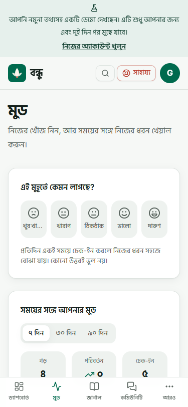

# Screenshot gallery

[Live demo](https://bondhu-life-coaching.vercel.app) · [Project case study](../PORTFOLIO.md) · [Main README](../../README.md)

These are real browser captures of Bondhu, not generated UI mockups. The expanded gallery was captured on **3 October 2026 (Asia/Dhaka)** from the hosted portfolio deployment. All displayed identities, mood notes, and journal entries are fictional demo data. Images show product presentation, not evidence of a clinical outcome or a security audit.

## Desktop

### Landing page · English / light

Route: `/` · 1440 × 900


### Dashboard · English / dark

Route: `/app` · 1440 × 960


### Mood tracking · English / light

Route: `/app/mood` · 1440 × 960


### Private journal · English / light

Route: `/app/journal` · 1440 × 960


### Calm arcade · English / light

Route: `/app/arcade` · 1440 × 960


## Mobile

### Dashboard · English / light

Route: `/app` · 375 × 812


### Mood tracking · Bangla / light

Route: `/app/mood` · 375 × 812



## Refreshing the images

### Capture from a local production preview

The existing `npm run screenshots` script captures the original landing/desktop/mobile views using an intercepted Supabase API and fictional fixtures. It never signs into a real user's account. Build with a valid public Supabase configuration in `.env.local`; the authenticated fixture pages need a configured client, but requests are intercepted during capture.

```bash
npm ci
npx playwright install chromium
npm run build
npm run preview -- --host 127.0.0.1 --port 4173
```

In a second terminal:

```bash
npm run screenshots
```

### Capture additional views

Open a clean browser profile against a production preview or the live demo, select **Try the demo**, and navigate to the routes listed above. Set the viewport, language, and theme to match each caption. Wait for fonts, charts, and data to finish loading; move focus away from menus and avoid open tooltips. Take viewport screenshots without browser chrome and save them under the filenames used here.

For automated one-off captures, write temporary artifacts under the git-ignored `output/playwright/` directory, inspect every image, then copy only approved PNGs to this directory. Never commit browser storage states, session tokens, HAR files, console logs, user exports, or screenshots of real accounts. Sign out of the temporary demo session when finished.

Do not present fixture captures as proof of hosted authentication or backend integration. When regenerating, update the capture date and provenance above if they change.
